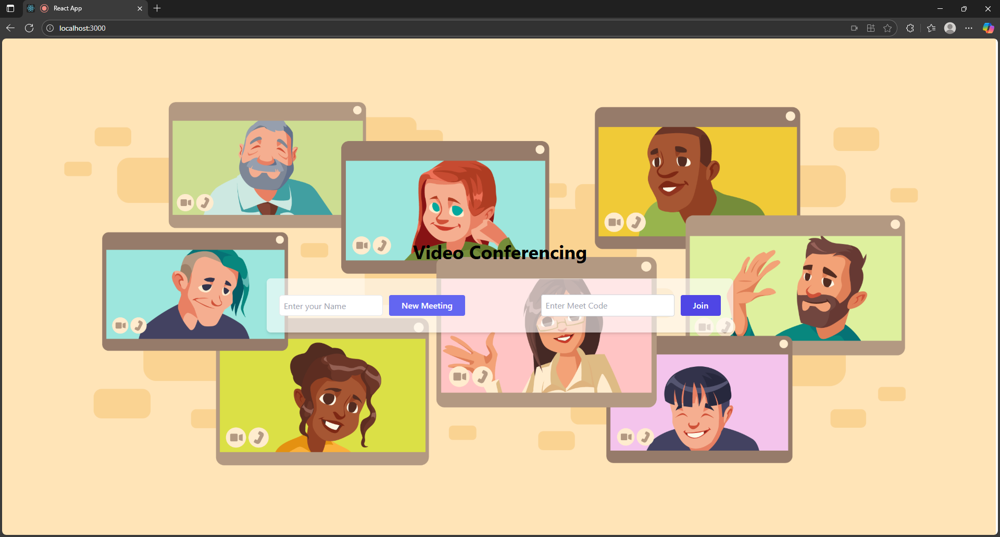
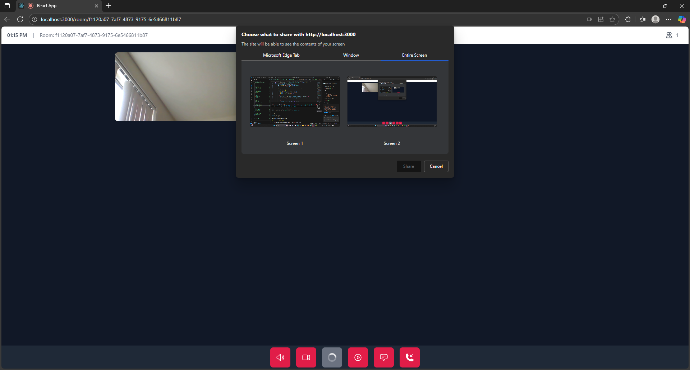

# MeetSpace - Real-Time Video Conferencing Platform

MeetSpace is a modern, real-time video conferencing application that enables seamless communication through high-quality video calls, screen sharing, and instant messaging. Built with React, TypeScript, and WebRTC, it provides a user-friendly interface similar to Google Meet while maintaining high performance and reliability.

## 📸 Screenshots




> Tip: keep images small (compressed PNG/JPG). For large/binary media, consider Git LFS.

## ✨ Features

- **Video Conferencing**
  - Real-time video and audio communication
  - Support for multiple participants
  - Automatic audio/video state persistence
  - Audio-only mode fallback

- **Screen Sharing**
  - Share your entire screen or specific windows
  - High-quality screen capture
  - Seamless transitions between video and screen content

- **Recording**
  - Record meetings with pause/resume functionality
  - Download recordings in WebM format
  - Recording timer and status indicators

- **Chat System**
  - Real-time text chat during meetings
  - Persistent chat history
  - Participant name display

- **User Interface**
  - Modern, responsive design
  - Dark theme for better visibility
  - Dynamic grid layout for participants
  - Collapsible participant sidebar
  - Device error handling with retry options

## 🚀 Technology Stack

- **Frontend:**
  - React
  - TypeScript
  - Tailwind CSS
  - Socket.IO Client

- **Backend:**
  - Node.js
  - Express
  - Socket.IO
  - PeerJS Server

- **Real-Time Communication:**
  - WebRTC
  - PeerJS
  - MediaRecorder API

## 🛠️ Installation

1. Clone the repository:
   ```bash
   git clone https://github.com/yourusername/meetspace.git
   ```

2. Install dependencies for all components:
   ```bash
   # Install client dependencies
   cd client-videoStreaming/client
   npm install

   # Install PeerJS server dependencies
   cd ../../peerjs-videoStreaming/peerjs
   npm install

   # Install main server dependencies
   cd ../../server-videoStreaming/server
   npm install
   ```

3. Set up environment variables:
   Create `.env` files in the respective directories with the following variables:
   ```env
   # server/.env
   PORT=8000

   # peerjs/.env
   PEERJS_PORT=9002
   ```

## 🚦 Running the Application

1. Start the main server:
   ```bash
   cd server-videoStreaming/server
   npm start
   ```

2. Start the PeerJS server:
   ```bash
   cd peerjs-videoStreaming/peerjs
   npm start
   ```

3. Start the client application:
   ```bash
   cd client-videoStreaming/client
   npm start
   ```

The application will be available at `http://localhost:3000`

## 💡 Usage

1. **Creating a Meeting**
   - Click "New Meeting" on the home page
   - Share the generated room ID with participants

2. **Joining a Meeting**
   - Enter the room ID in the "Join Meeting" field
   - Click "Join" to enter the meeting

3. **During the Meeting**
   - Toggle audio/video using the control bar
   - Share your screen using the share button
   - Open chat using the chat button
   - View participants in the sidebar
   - Record the meeting using the record button

## 🔒 Privacy and Security

- All video/audio communication is peer-to-peer
- No meeting content is stored on servers
- Room IDs are randomly generated UUIDs
- Device permissions are explicitly requested

## 🤝 Contributing

1. Fork the repository
2. Create a feature branch (`git checkout -b feature/AmazingFeature`)
3. Commit your changes (`git commit -m 'Add some AmazingFeature'`)
4. Push to the branch (`git push origin feature/AmazingFeature`)
5. Open a Pull Request

## 📝 License

This project is licensed under the MIT License - see the [LICENSE](LICENSE) file for details.

## 🙏 Acknowledgments

- [WebRTC](https://webrtc.org/) for the real-time communication technology
- [PeerJS](https://peerjs.com/) for simplifying WebRTC implementation
- [Socket.IO](https://socket.io/) for real-time signaling
- [React](https://reactjs.org/) for the frontend framework
- [Tailwind CSS](https://tailwindcss.com/) for styling

---

## 👥 Contact

Your Name - your.email@example.com
Project Link: [https://github.com/yourusername/meetspace](https://github.com/yourusername/meetspace)

---

Made with ❤️ by [Your Name]